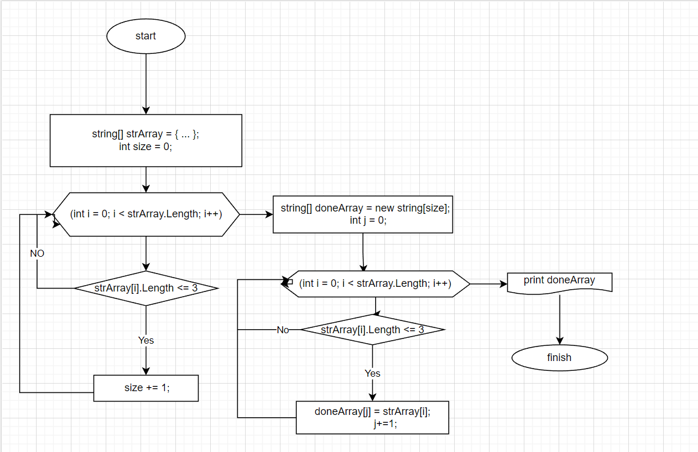

#  Итоговая аттестация Турукина Станислава Игоревича.
## Дано задание:
Задача алгоритмически не самая сложная, однако для полноценного выполнения проверочной работы необходимо:

1. Создать репозиторий на GitHub
2. Нарисовать блок-схему алгоритма (можно обойтись блок-схемой основной содержательной части, если вы выделяете её в отдельный метод)
3. Снабдить репозиторий оформленным текстовым описанием решения (файл README.md)
4. Написать программу, решающую поставленную задачу
5. Использовать контроль версий в работе над этим небольшим проектом (не должно быть так, что всё залито одним коммитом, как минимум этапы 2, 3, и 4 должны быть расположены в разных коммитах)

Задача: Написать программу, которая из имеющегося массива строк формирует новый массив из строк, длина которых меньше, либо равна 3 символам. Первоначальный массив можно ввести с клавиатуры, либо задать на старте выполнения алгоритма. При решении не рекомендуется пользоваться коллекциями, лучше обойтись исключительно массивами.

Примеры:
[“Hello”, “2”, “world”, “:-)”] → [“2”, “:-)”]
[“1234”, “1567”, “-2”, “computer science”] → [“-2”]
[“Russia”, “Denmark”, “Kazan”] → []

## Ход работы:
- Для начала создали локальный репозиторий "FinalExamination".
- Создали одноименный репозиторий на GitHub.
- Создали файл README.md, закомитили и запушили.
### Далее будем заполнять данный файл по ходу выполненой работы. 

## Далее я решил сначала написать код для заданной задачи. 
- В коде я использовал несколько методов, попутно комментируя смысл данных операций.
- После написания программы я добавил данный файл в git и запушил в удаленный репозиторий.
- Сейчас внес эту информацию в Readme.md.  
## Ну и последним пунктом я сделал блок-схему для нашей задачи в программе draw.io.
  
## Вот и всё. Итоговая аттестация пройдена!
 
